# Rooh Experience Intelligence — System Architecture
### AI-powered Experience Discovery, Structuring, Validation & Human Review

> **Founding Product Engineer Assignment Technical Specification**  
> Based strictly on the implementation in this repository.

---

## 1. System Architecture Diagram

```mermaid
flowchart LR
    %% Title Box
    subgraph STAGE1["1. Sources & Input"]
        direction TB
        URL_INPUT["Experience URL Input<br/><code>DiscoverPage.tsx</code>"]
        DEMO_INPUT["Demo / Sample Trigger<br/><code>demo_data.py</code>"]
    end

    subgraph STAGE2["2. Web Extraction"]
        direction TB
        HTTPX_SCRAPER["Async HTTP Scraper<br/><code>httpx</code>"]
        BS4_PARSER["HTML Cleaner & Text Stripper<br/><code>BeautifulSoup4</code>"]
        SCRAPE_FALLBACK["Scraping Fallback Handler<br/><code>fetcher.py</code>"]
    end

    subgraph STAGE3["3. AI Structuring Engine"]
        direction TB
        OPENAI_API["OpenAI API Agent<br/><code>gpt-4o-mini + JSON Schema</code>"]
        SMART_HEURISTIC["Smart Heuristic Engine<br/><code>ai_extractor.py</code> (Offline/Demo)"]
        HALLUCINATION_CONTROL["Anti-Hallucination Policy<br/>Missing fields → <code>null</code>"]
        RELEVANCE_CLASSIFIER["Relevance Classifier<br/>Score 0–100 & Reason"]
    end

    subgraph STAGE4["4. Validation & Intelligence"]
        direction TB
        DETERMINISTIC_VALIDATOR["Deterministic Validator<br/><code>validator.py</code>"]
        CONFIDENCE_CALCULATOR["Confidence Calculator<br/><code>confidence.py</code> (0–100 Score)"]
        FUZZY_DEDUPLICATOR["Fuzzy Duplicate Matcher<br/><code>deduplicator.py</code>"]
        CONFLICT_FLAGGER["Conflicting Info Flagger<br/>Cross-source alerts"]
    end

    subgraph STAGE5["5. Database & API"]
        direction TB
        REST_API_GW["FastAPI REST API Gateway<br/><code>routes/experiences.py</code>"]
        PYDANTIC_SCHEMAS["Pydantic Schemas<br/><code>schemas.py</code>"]
        SQLITE_DB[("SQLite Database<br/><code>rooh_experiences.db</code><br/>SQLAlchemy ORM")]
    end

    subgraph STAGE6["6. Human Review & CMS"]
        direction TB
        DASHBOARD_UI["Dashboard & Statistics<br/><code>DashboardPage.tsx</code>"]
        REVIEW_DRAWER["Human Review Drawer<br/><code>ReviewPage.tsx</code><br/><b>AI NEVER AUTO-PUBLISHES</b>"]
        CMS_CATALOG["Experiences CMS<br/><code>CMSPage.tsx</code>"]
        STATUS_STATE["Review Status State Machine<br/><code>needs_review</code> → <code>approved</code> / <code>rejected</code>"]
    end

    subgraph FUTURE_STAGE["FUTURE — NOT IMPLEMENTED"]
        direction TB
        POSTGRES_FUTURE[("⚡ PostgreSQL<br/>Production DB Migration")]
        PLAYWRIGHT_FUTURE["⚡ Playwright / Puppeteer<br/>JS SPA Crawling"]
        CRON_FUTURE["⚡ Scheduled Cron Jobs<br/>Automated Discovery"]
    end

    %% Main Architecture Data Flow
    URL_INPUT -->|AnalyzeRequest| HTTPX_SCRAPER
    DEMO_INPUT -->|Demo Payload| BS4_PARSER
    HTTPX_SCRAPER --> BS4_PARSER
    
    %% Fallback paths (Dashed)
    HTTPX_SCRAPER -.->|Scrape Error / Blocked| SCRAPE_FALLBACK
    SCRAPE_FALLBACK -.-> SMART_HEURISTIC
    BS4_PARSER -->|FetchResult| OPENAI_API
    OPENAI_API -.->|API Unavailable / Failed| SMART_HEURISTIC
    
    OPENAI_API --> HALLUCINATION_CONTROL
    SMART_HEURISTIC -.-> HALLUCINATION_CONTROL
    HALLUCINATION_CONTROL --> RELEVANCE_CLASSIFIER
    
    RELEVANCE_CLASSIFIER -->|AIExtractionOutput + AIRelevanceResult| DETERMINISTIC_VALIDATOR
    DETERMINISTIC_VALIDATOR -->|ValidationIssue| CONFIDENCE_CALCULATOR
    CONFIDENCE_CALCULATOR -->|ConfidenceDetail| FUZZY_DEDUPLICATOR
    FUZZY_DEDUPLICATOR -->|PossibleDuplicate| CONFLICT_FLAGGER
    CONFLICT_FLAGGER -->|ConflictingInfo| REST_API_GW

    REST_API_GW --> PYDANTIC_SCHEMAS
    PYDANTIC_SCHEMAS --> SQLITE_DB

    %% Frontend / Backend Separation
    SQLITE_DB <-->|REST API JSON| DASHBOARD_UI
    SQLITE_DB <-->|REST API JSON| REVIEW_DRAWER
    SQLITE_DB <-->|REST API JSON| CMS_CATALOG
    
    REVIEW_DRAWER -->|Experience.status| STATUS_STATE

    %% Future Migration Connections (Dashed)
    SQLITE_DB -.->|Schema Compatible| POSTGRES_FUTURE
    HTTPX_SCRAPER -.->|Replace Scraper| PLAYWRIGHT_FUTURE
    URL_INPUT -.->|Automate Discovery| CRON_FUTURE

    %% Styling & Legend
    classDef implemented fill:#0f172a,stroke:#386c6f,stroke-width:2px,color:#fff;
    classDef future fill:#1e1b4b,stroke:#6366f1,stroke-width:2px,stroke-dasharray: 5 5,color:#c7d2fe;
    classDef db fill:#064e3b,stroke:#10b981,stroke-width:2px,color:#fff;

    class URL_INPUT,DEMO_INPUT,HTTPX_SCRAPER,BS4_PARSER,SCRAPE_FALLBACK,OPENAI_API,SMART_HEURISTIC,HALLUCINATION_CONTROL,RELEVANCE_CLASSIFIER,DETERMINISTIC_VALIDATOR,CONFIDENCE_CALCULATOR,FUZZY_DEDUPLICATOR,CONFLICT_FLAGGER,REST_API_GW,PYDANTIC_SCHEMAS,DASHBOARD_UI,REVIEW_DRAWER,CMS_CATALOG,STATUS_STATE implemented;
    class SQLITE_DB db;
    class POSTGRES_FUTURE,PLAYWRIGHT_FUTURE,CRON_FUTURE future;
```

### 🎯 Legend
- **Solid Boxes / Arrows**: Implemented functionality in repository
- **Dashed Arrows**: Fallback execution path or Future scaling migration
- **Cylinder**: Storage database

---

## 2. File & Component Mapping

| Stage | Box Name in Diagram | File / Module Location | Implementation Detail |
|---|---|---|---|
| **1** | Experience URL Input | [`frontend/src/pages/DiscoverPage.tsx`](file:///c:/Users/hp/Desktop/rooh/frontend/src/pages/DiscoverPage.tsx) | React URL search form with live progress stepper. |
| **1** | Demo / Sample Trigger | [`backend/app/services/demo_data.py`](file:///c:/Users/hp/Desktop/rooh/backend/app/services/demo_data.py) | 4 pre-configured growth templates for instant testing. |
| **2** | Async HTTP Scraper | [`backend/app/services/fetcher.py`](file:///c:/Users/hp/Desktop/rooh/backend/app/services/fetcher.py#L13) | `httpx.AsyncClient` with browser user-agent headers. |
| **2** | HTML Cleaner & Text Stripper | [`backend/app/services/fetcher.py`](file:///c:/Users/hp/Desktop/rooh/backend/app/services/fetcher.py#L38) | `BeautifulSoup` stripping nav, footer, script, and style tags. |
| **2** | Scraping Fallback Handler | [`backend/app/services/fetcher.py`](file:///c:/Users/hp/Desktop/rooh/backend/app/services/fetcher.py#L50) | Graceful error diagnostics for JS SPAs or network blocks. |
| **3** | OpenAI API Agent | [`backend/app/services/ai_extractor.py`](file:///c:/Users/hp/Desktop/rooh/backend/app/services/ai_extractor.py#L22) | `gpt-4o-mini` with enforced JSON response formatting. |
| **3** | Smart Heuristic Engine | [`backend/app/services/ai_extractor.py`](file:///c:/Users/hp/Desktop/rooh/backend/app/services/ai_extractor.py#L82) | Heuristic rule parser used offline or when API key is unset. |
| **3** | Anti-Hallucination Policy | [`backend/app/services/ai_extractor.py`](file:///c:/Users/hp/Desktop/rooh/backend/app/services/ai_extractor.py#L7) | Prompt enforcing explicit `null` for missing facts. |
| **3** | Relevance Classifier | [`backend/app/services/ai_extractor.py`](file:///c:/Users/hp/Desktop/rooh/backend/app/services/ai_extractor.py#L71) | 0–100% personal growth alignment rating & reasoning. |
| **4** | Deterministic Validator | [`backend/app/services/validator.py`](file:///c:/Users/hp/Desktop/rooh/backend/app/services/validator.py#L5) | Rule validator emitting structured `ValidationIssue` alerts. |
| **4** | Confidence Calculator | [`backend/app/services/confidence.py`](file:///c:/Users/hp/Desktop/rooh/backend/app/services/confidence.py#L5) | 8-factor score engine (0–100) assigning High/Medium/Low label. |
| **4** | Fuzzy Duplicate Matcher | [`backend/app/services/deduplicator.py`](file:///c:/Users/hp/Desktop/rooh/backend/app/services/deduplicator.py#L34) | `SequenceMatcher` + token overlap matching existing records. |
| **4** | Conflicting Info Flagger | [`backend/app/services/demo_data.py`](file:///c:/Users/hp/Desktop/rooh/backend/app/services/demo_data.py#L60) | Flags cross-referenced ticket price/time discrepancies. |
| **5** | FastAPI REST API | [`backend/app/routes/experiences.py`](file:///c:/Users/hp/Desktop/rooh/backend/app/routes/experiences.py#L84) | Endpoint handlers (`/analyze`, `/stats`, `/approve`, `/reject`). |
| **5** | Pydantic Schemas | [`backend/app/schemas.py`](file:///c:/Users/hp/Desktop/rooh/backend/app/schemas.py#L48) | Pydantic v2 schemas (`ExperienceResponse`, `AnalyzeRequest`). |
| **5** | SQLite Database | [`backend/app/database.py`](file:///c:/Users/hp/Desktop/rooh/backend/app/database.py#L9) | `rooh_experiences.db` via SQLAlchemy ORM models. |
| **6** | Dashboard & Statistics | [`frontend/src/pages/DashboardPage.tsx`](file:///c:/Users/hp/Desktop/rooh/frontend/src/pages/DashboardPage.tsx) | 5 KPI metrics cards and live discovered experiences table. |
| **6** | Human Review Drawer | [`frontend/src/pages/ReviewPage.tsx`](file:///c:/Users/hp/Desktop/rooh/frontend/src/pages/ReviewPage.tsx) | Dual-column audit drawer (**AI NEVER AUTO-PUBLISHES**). |
| **6** | Experiences CMS | [`frontend/src/pages/CMSPage.tsx`](file:///c:/Users/hp/Desktop/rooh/frontend/src/pages/CMSPage.tsx) | Verified experience catalog with search & category filters. |

---

## 3. Key Architectural Principles Demonstrated

1. **Modular Processing Pipeline**: Each service module ([`fetcher.py`](file:///c:/Users/hp/Desktop/rooh/backend/app/services/fetcher.py), [`ai_extractor.py`](file:///c:/Users/hp/Desktop/rooh/backend/app/services/ai_extractor.py), [`validator.py`](file:///c:/Users/hp/Desktop/rooh/backend/app/services/validator.py), [`confidence.py`](file:///c:/Users/hp/Desktop/rooh/backend/app/services/confidence.py), [`deduplicator.py`](file:///c:/Users/hp/Desktop/rooh/backend/app/services/deduplicator.py)) is decoupled and individually testable.
2. **Strict Frontend/Backend Separation**: React + TypeScript frontend connects to FastAPI through async REST APIs over standard JSON objects.
3. **Separation of Extraction vs Validation**: AI extracts raw text facts; deterministic Python code performs quality validation and confidence scoring to prevent LLM validation bias.
4. **Human-in-the-Loop Approval**: Newly analyzed records default to `needs_review`. Human approval in [`ReviewPage.tsx`](file:///c:/Users/hp/Desktop/rooh/frontend/src/pages/ReviewPage.tsx) is required to transition to `approved`.
5. **Non-Destructive Handling**: Duplicates and conflicting info generate non-destructive warning flags without overwriting or deleting records.
6. **Anti-Hallucination Controls**: Enforced via explicit system prompts, Pydantic optional types, missing field checks, and confidence score penalties.
