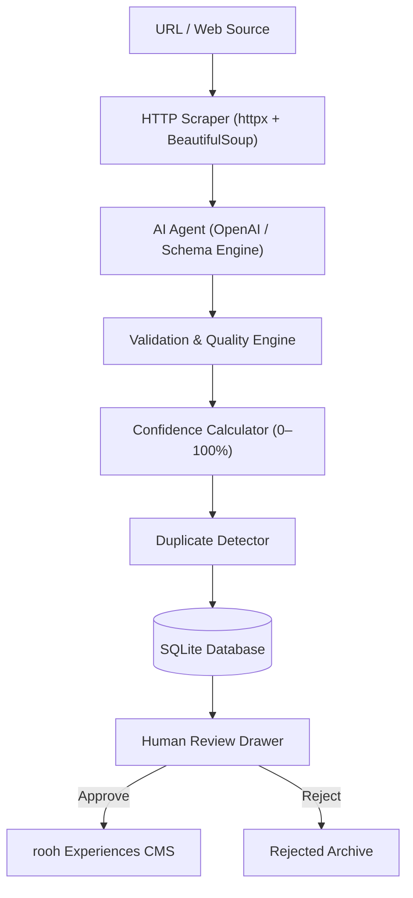

# Rooh Experience Intelligence 🧘✨

> **Founding Product Engineer Take-Home POC for rooh**  
> A vertical-slice web application for discovering, extracting, structuring, validating, deduplicating, and curating intentional personal growth experiences with human-in-the-loop approval.

---

## 📌 Problem Statement

**rooh** is building a platform for intentional personal growth. A core challenge is discovering high-quality experiences (workshops, retreats, seminars, masterclasses) across disparate web sources, extracting their information reliably, structuring it consistently, validating data quality, and preparing it for human curation without introducing hallucinations or inaccurate data.

## 💡 Solution Overview

**Rooh Experience Intelligence** solves this by establishing a clear 8-stage vertical workflow:
$$\text{Sources} \rightarrow \text{Discovery} \rightarrow \text{Extraction} \rightarrow \text{AI Structuring} \rightarrow \text{Validation/Deduplication} \rightarrow \text{Database} \rightarrow \text{CMS/Review} \rightarrow \text{Human Approval}$$

- **Zero Hallucination Guarantee**: Unavailable fields are set to `null` instead of being invented.
- **Human-in-the-Loop Approval**: AI never auto-publishes experiences; human reviewers retain final approval authority.
- **Out-of-the-Box Demo Mode**: Works seamlessly with or without an OpenAI API key or live scraping access.

---

## 📐 Architecture



---

## 🛠 Tech Stack

| Layer | Technology |
|---|---|
| **Frontend** | React 18, TypeScript, Vite, Tailwind CSS, Lucide React, Axios |
| **Backend** | Python 3.12, FastAPI, Pydantic v2, SQLAlchemy ORM |
| **AI / NLP** | OpenAI API (`gpt-4o-mini`), Pydantic JSON Schema, Heuristic Rule Extractor |
| **Web Scraping** | `httpx`, `BeautifulSoup4` |
| **Database** | SQLite (designed with PostgreSQL migration compatibility) |
| **Testing** | `pytest` |

---

## 🚀 How to Run Locally

### Prerequisites
- Python 3.10+
- Node.js v18+ & `npm`

### 1. Clone & Set Up Backend

```bash
cd backend

# Create & activate Python virtual environment
python -m venv venv

# On Windows:
venv\Scripts\activate

# On macOS/Linux:
source venv/bin/activate

# Install dependencies
pip install -r requirements.txt

# (Optional) Copy environment variables template
cp ../.env.example .env
```

To run the backend FastAPI server:
```bash
uvicorn app.main:app --reload --port 8000
```
*API interactive documentation will be available at `http://localhost:8000/docs`.*

### 2. Set Up & Run Frontend

In a new terminal window:

```bash
cd frontend

# Install Node dependencies
npm install

# Start Vite dev server
npm run dev
```
*Open `http://localhost:5173` in your browser.*

---

## 🧪 Running Tests

To execute the backend unit test suite (URL validation, schema extraction, confidence scoring, duplicate matching):

```bash
cd backend
venv\Scripts\pytest
```

---

## 🌟 Demo Mode

The application operates out-of-the-box in **Demo Mode**:
1. Open the application at `http://localhost:5173`.
2. Click **Discover Experience** in the navigation bar.
3. Click **Use Demo Experience** or select any of the 4 pre-configured growth sample experiences:
   - **Mindfulness & Conscious Living Workshop (Hyderabad)** — High confidence demo
   - **Himalayan Yoga & Wellness Retreat (Bangalore)** — Multi-day retreat case
   - **Personal Leadership Masterclass (Delhi)** — Emotional intelligence focus
   - **Conflicting Price Test Case** — Demonstrates cross-referenced source price discrepancy warnings
4. Watch the step-by-step progress stepper transition live into the **Human Review Drawer**.

---

## 🧠 Key Technical & Product Decisions

1. **Strict Null Policy**: If price, date, or organizer is missing from the webpage context, the field explicitly defaults to `null`.
2. **Transparent Confidence Formula**: Calculates points based on 8 weighted factors to give reviewers immediate insight into data completeness.
3. **Fuzzy Deduplication**: Uses string normalization and token overlap to flag possible duplicate experiences without destroying data.
4. **Conflicting Info Flags**: Stores multi-source discrepancies as warning items for reviewer resolution.
5. **PostgreSQL Ready**: Database models use string UUID keys, UTC timestamps, and standard SQLAlchemy constructs for easy production migration.

---

## ⚠️ Limitations & Future Scalability

- **JavaScript Heavy Rendering**: Webpages requiring complex client-side JS rendering (e.g. Single-Page Apps) fallback to structured heuristic parsing or demo mode. In production, headless browser rendering (Playwright/Puppeteer) would be added.
- **Automated Scheduling**: In production, recurring discovery jobs would periodically crawl registered partner sites.
